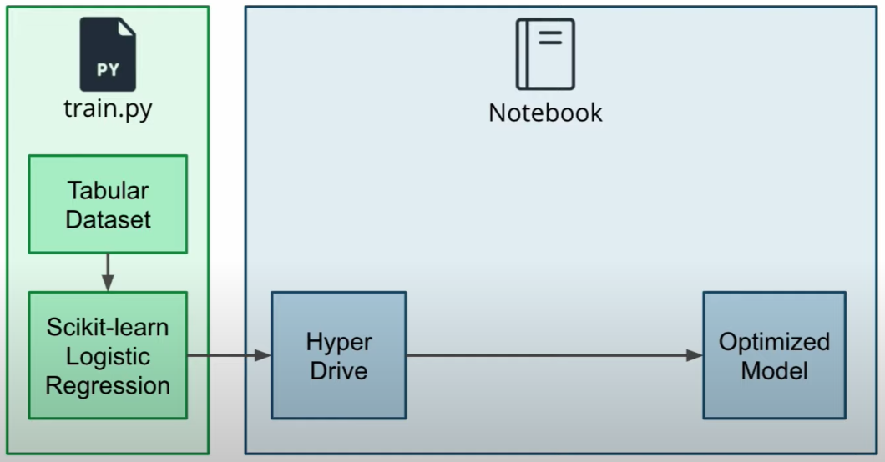

# Optimizing an ML Pipeline in Azure

## Overview
This project is part of the Udacity Azure ML Nanodegree.
In this project, we build and optimize an Azure ML pipeline using the Python SDK and a provided Scikit-learn model.
This model is then compared to an Azure AutoML run.

## Summary
The Bank Marketing dataset, sourced from the [UCI ML](https://archive.ics.uci.edu/dataset/222/bank+marketing) Repository, contains demographic data and responses (Yes or No) from bank clients to direct phone marketing campaigns promoting term deposit products. Its primary objective involves predicting whether a client will choose to subscribe to a term deposit. This dataset includes various columns depicting client demographics as input variables, with the 'y' output variable representing the binary status of whether the client has opted for a term deposit, denoted as Yes or No. Essentially, this dataset forms the foundation for modeling efforts aimed at forecasting clients' decisions regarding term deposit subscriptions based on their demographic profiles.

The VotingEnsemble, an ensemble model generated through AutomML, stands out as the top-performing model. It boasts an impressive accuracy rate of **91.49%**. In comparison, the LogicRegression model, supported by HyperDrive in Scikit-learn, achieves an accuracy of **91.08%**. This signifies that the VotingEnsemble model outperforms the LogicRegression model by a margin of **0.41%** in terms of accuracy, showcasing its superiority in predictive capabilities in this scenario.

## Scikit-learn Pipeline

**Pipeline architecture**

The pipeline architecture involves several components orchestrated to train a machine-learning model. Here's an overview:

**1. Python Training Script ([train.py](https://github.com/robiulrafi/AZURE_ML_ND_PORTFOLIO/blob/main/project_1/train.py))**: This script contains the code responsible for training the model. It likely includes data preprocessing, model fitting, and evaluation steps.

**2. Tabular Dataset from UCI ML Repository**: This dataset sourced from the UCI ML Repository serves as the input data for training the machine learning model. It contains the information required for model learning and prediction.

**3. Scikit-learn Logistic Regression Algorithm**: This algorithm, provided by Scikit-learn, is utilized for model training. It's a linear classification algorithm used to predict categorical outcomes based on input features.

**4. Azure HyperDrive**: The Scikit-learn Logistic Regression model is connected to Azure HyperDrive, which functions as a hyperparameter tuning engine. HyperDrive explores different hyperparameter configurations to optimize the model's performance, enhancing its accuracy or other specified metrics.

**5. Jupyter Notebook on Compute Instance**: The training run is managed and executed through a [Jupyter Notebook](https://github.com/robiulrafi/AZURE_ML_ND_PORTFOLIO/blob/main/project_1/udacity-project.ipynb) hosted on a compute instance. This notebook likely coordinates data loading, model training, hyperparameter tuning setup, and monitoring of the training process.

The architecture diagram as demonstrated below, credited to Udacity's **MLEMA Nanodegree**, provides a visual representation of the logical flow of these components, showcasing how they interact and contribute to the model training process.

**Explain the pipeline architecture, including data, hyperparameter tuning, and classification algorithm.**

**What are the benefits of the parameter sampler you chose?**

**What are the benefits of the early stopping policy you chose?**

## AutoML
**In 1-2 sentences, describe the model and hyperparameters generated by AutoML.**

## Pipeline comparison
**Compare the two models and their performance. What are the differences in accuracy? In architecture? If there was a difference, why do you think there was one?**

## Future work
**What are some areas of improvement for future experiments? Why might these improvements help the model?**

## Proof of cluster clean up
**If you did not delete your compute cluster in the code, please complete this section. Otherwise, delete this section.**
**Image of cluster marked for deletion**
